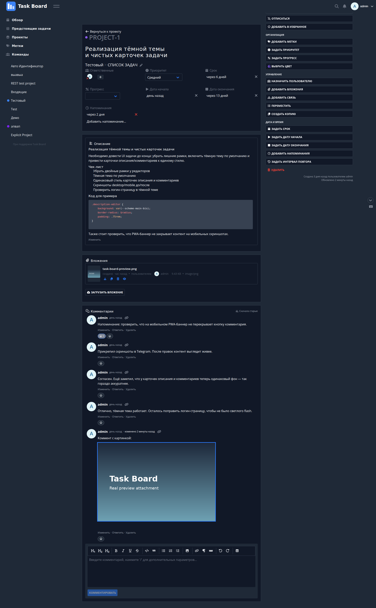

# Task Board

Self-hosted Kanban-доска. Бэкенд на Go, фронтенд на Vue 3 + Vite, PostgreSQL.



## Запуск

```bash
cd /opt/dev/task-board
docker compose build
docker compose up -d
```

URL в локальной сети: `http://192.168.1.135:19876`

Логин по умолчанию: `admin` / `admin`.

## Смена IP или порта

Правь `TASKBOARD_SERVICE_PUBLICURL` и порт проброса в `docker-compose.yml`, затем `docker compose up -d`.

## Переменные окружения

| Переменная | Значение по умолчанию | Описание |
|---|---|---|
| `TASKBOARD_SERVICE_PUBLICURL` | `http://192.168.1.135:19876/` | Публичный URL |
| `TASKBOARD_SERVICE_ENABLEREGISTRATION` | `false` | Регистрация новых пользователей |
| `TASKBOARD_SERVICE_JWT_SECRET` | `d3f4ault-s3cr3t-ch4ng3-m3` | JWT-секрет (сменить в production) |
| `TASKBOARD_DATABASE_TYPE` | `postgres` | Тип БД |
| `TASKBOARD_DATABASE_HOST` | `task-board-db` | Хост БД |
| `TASKBOARD_DATABASE_PORT` | `5432` | Порт БД |
| `TASKBOARD_DATABASE_DATABASE` | `taskboard` | Имя БД |
| `TASKBOARD_DATABASE_USER` | `taskboard` | Пользователь БД |
| `TASKBOARD_DATABASE_PASSWORD` | `t4skb04rd-p4ss` | Пароль БД (сменить в production) |

## Структура проекта

```
.
├── frontend/           # Vue 3 SPA
│   ├── src/components/ # компоненты
│   ├── src/views/      # страницы
│   ├── src/services/   # API-клиенты
│   └── src/stores/     # Pinia-сторы
├── pkg/                # Go-бэкенд
│   ├── models/         # доменные модели
│   ├── routes/         # HTTP-роуты
│   ├── services/       # бизнес-логика
│   ├── web/            # CRUD-хендлеры
│   └── migration/      # миграции БД
├── docker-compose.yml
├── Dockerfile
└── magefile.go         # dev-задачи
```

## Dev-команды

Backend:

```bash
mage build           # сборка бинарника
mage test:web        # веб-тесты
mage lint:fix        # линтер + автофикс
mage fmt             # форматирование
```

Frontend:

```bash
cd frontend
pnpm install
pnpm dev             # http://127.0.0.1:4173
pnpm build           # production build
pnpm lint:fix
pnpm lint:styles:fix
pnpm typecheck
```

E2E-тесты запускать только через `mage test:e2e`.

## Документация

- `AGENTS.md` — правила для AI-разработчиков
- `frontend/README.md` — разработка фронтенда
- `frontend/docs/models-services.md` — модели и сервисы
